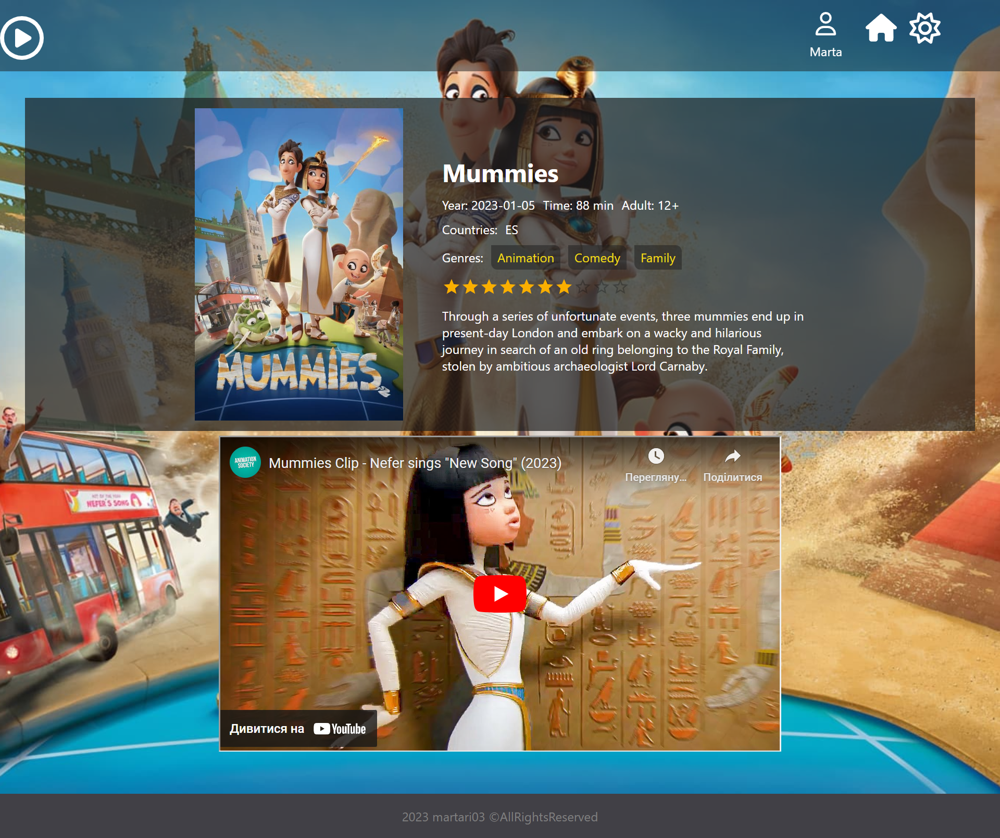
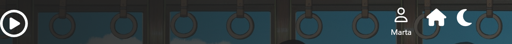
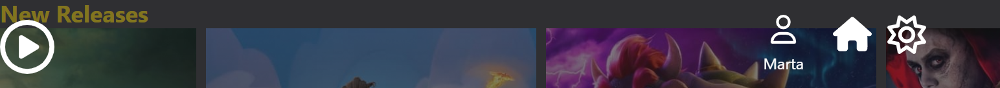

# Project to show skills of using React and Redux

This project was bootstrapped with [Create React App](https://github.com/facebook/create-react-app).

It the React project where I use themoviedb API and Redux.

### The main page view in light and dark themes

You can see list of all movies some swippers with new
releases or now playing. You can search the movie by yourself or filter them by genres. Also, you can change the theme.
When you click on movie you will be redirected to the page with its details and trailer.

### The movie page view

You can see the details of this movie and watch trailer.

### The menu bar view light and dark themes

By clicking on **play** and **house** buttons you will be redirected to main page.
The **user** contains user info and **sun** or **moon** buttons to change the theme.

## Available Scripts

In the project directory, you can run:

### `yarn start`

Runs the app in the development mode.\
Open [http://localhost:3000](http://localhost:3000) to view it in your browser.

The page will reload when you make changes.\
You may also see any lint errors in the console.

